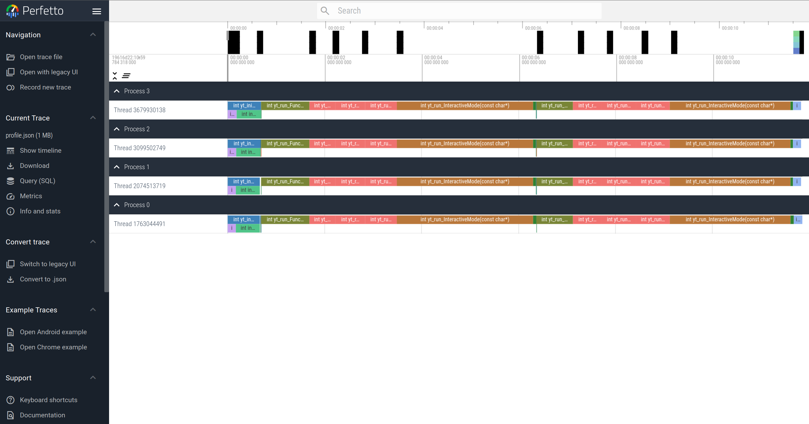

# Time Profiling
{: .no_toc }
<details open markdown="block">
  <summary>
    Table of contents
  </summary>
  {: .text-delta }
- TOC
{:toc}
</details>
---

## How to Configure?

Compile `libyt` with `-DSUPPORT_TIMER` option. (See [How to Install](#options))

## Visualizing the Profile -- Chrome Tracing
1. Since each process dumps its profile `libytTimeProfile_MPI*.json` separately, we run the following to concatenate all of them:
   ```bash
   cat `ls libytTimeProfile_MPI*` >> TimeProfile.json
   ```
2. Open Google Chrome and enter `chrome://tracing`, or go [Perfetto](https://ui.perfetto.dev/).
3. Load the time profile `TimeProfile.json`.
   
   
