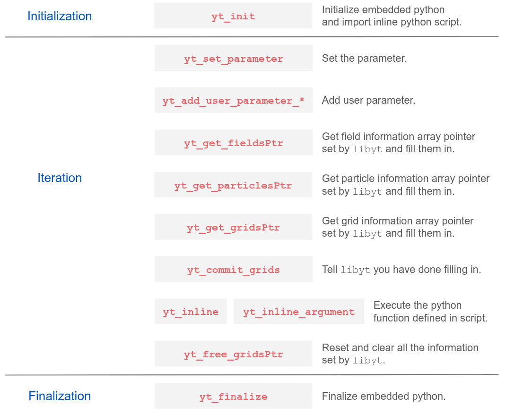

# User Guide
This guide will walk you through how to implement `libyt` into your code. And how you can convert your everyday used `yt` script to do inline-analysis. 

- Implement `libyt` to your code step by step
  - [Initialize - `yt_init`](./Initialize.md#initialize)
  - [Set `yt` Parameter - `yt_set_parameter`](./SetYTParameter.md#set-yt-parameter)
  - [Set Code Specific Parameter - `yt_add_user_parameter_*`](./SetCodeSpecificParameter.md#set-code-specific-parameter)
  - [Set Fields Information - `yt_get_fieldsPtr`](./SetFieldsInformation.md#set-fields-information)
  - [Set Particles Information - `yt_get_particlesPtr`](./SetParticlesInformation.md#set-particles-information)
  - [Set Local Grids Information - `yt_get_gridsPtr`](./SetLocalGridsInformation.md#set-local-grids-information)
  - [Commit Your Settings - `yt_commit_grids`](./CommitYourSettings.md#commit-your-settings)
  - [Perform Inline-Analysis - `yt_inline` and `yt_inline_argument`](./PerformInlineAnalysis.md#perform-inline-analysis)
  - [Free Resource - `yt_free_gridsPtr`](./FreeResource.md#free-resource)
  - [Finalize - `yt_finalize`](./Finalize.md#finalize)
- [Inline Python Script](./InlinePythonScript.md#inline-python-script)

## Overview
