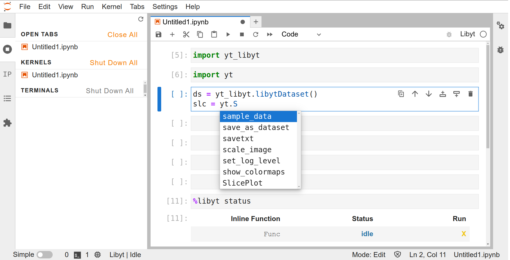

# Jupyter Notebook Access

```{toctree}
:hidden:

local-desktop
remote-cluster
```

## Requirements

- Compile `libyt` in **jupyter kernel mode** ([`-DJUPYTER_KERNEL=ON`](../../how-to-install.md#-djupyter_kernel)).
- Call libyt API [`yt_run_JupyterKernel`](../../libyt-api/yt_run_jupyterkernel.md#yt_run_jupyterkernel).
- Python package [`jupyter_libyt`](../../how-to-install.md#jupyter_libyt), [`jupyter-client`](https://jupyter-client.readthedocs.io/en/stable/index.html), and [`jedi`](https://jedi.readthedocs.io/en/latest/).

## Setting Up

During simulation runtime, `libyt` will activate libyt Jupyter kernel (libyt kernel). 
We need another process to start Jupyter Notebook/JupyterLab and connect to libyt kernel. 

### Starting Jupyter Notebook/JupyterLab

> {octicon}`info;1em;sd-text-info;` The process of starting Jupyter Notebook/JupyterLab and running simulation are separate and independent.

1. Get [`jupyter_libyt`](../../how-to-install.md#jupyter_libyt) and [`jupyter-client`](https://jupyter-client.readthedocs.io/en/stable/index.html).
2. After installing `libyt`, add `<libyt-install-prefix>/share/jupyter` to [`JUPYTER_PATH`](https://docs.jupyter.org/en/latest/use/jupyter-directories.html#envvar-JUPYTER_PATH).
   ```bash
   export JUPYTER_PATH=<libyt-install-prefix>/share/jupyter:$JUPYTER_PATH
   ```
   Check if `libyt_kernel` is listed:
   ```bash
   jupyter kernelspec list
   ```
3. Export environment variable `LIBYT_KERNEL_INFO_DIR` to where the simulation executable directory is.
   ```bash
   export LIBYT_KERNEL_INFO_DIR=<path-to-simulation-dir>
   ```
   > {octicon}`info;1em;sd-text-info;` Jupyter Notebook / JupyterLab will grab the connection information in `LIBYT_KERNEL_INFO_DIR` environment variable.
4. Launch Jupyter Notebook/JupyterLab
   ```bash
   jupyter notebook # launch Jupyter Notebook
   jupyter-lab      # launch JupyterLab
   ```
5. Click `Libyt` to connect to libyt kernel once the simulation is running and libyt kernel is activated.

### Running Simulation

1. Compile `libyt` in **jupyter kernel mode** ([`-DJUPYTER_KERNEL=ON`](../../how-to-install.md#-djupyter_kernel)).
2. Call libyt API [`yt_run_JupyterKernel`](../../libyt-api/yt_run_jupyterkernel.md#yt_run_jupyterkernel). When flag file is detected, `libyt` will activate libyt kernel.
3. libyt API [`yt_run_JupyterKernel`](../../libyt-api/yt_run_jupyterkernel.md#yt_run_jupyterkernel) returns `YT_SUCCESS` after libyt kernel shuts down (see [How to Exit](#how-to-exit)).
4. Simulation can continue its process.

### Example

- [Connecting to Kernel on Local Machine](./local-desktop.md#example----connecting-to-kernel-on-local-machine)
- [Connecting to Kernel on HPC Cluster](./remote-cluster.md#example----connecting-to-kernel-on-hpc-cluster)

## Using Jupyter Notebook/JupyterLab

### Basics



#### Python Prompt and libyt Defined Commands

The cell takes Python statements and [libyt Defined Commands](../libyt-defined-command.md#libyt-defined-commands).
It can also import other Python modules.

> {octicon}`alert;1em;sd-text-danger;` Put Python statements and libyt defined commands in separate cells.

:::
##### How does it execute Python statements and libyt defined commands?
:::
1. Takes user inputs in the cell.
2. MPI root process broadcasts the inputs to other processes.
3. Every MPI process executes the same piece of input synchronously.
4. Get outputs from each process and print feedbacks on the screen.

> {octicon}`alert;1em;sd-text-danger;` Changes is kept and maintained in user's inline [`script`](../../libyt-api/yt_initialize.md#yt_param_libyt)'s namespace, and it will be brought to the following round of in situ analysis.

#### Auto-Completion

Use `TAB` key to do auto-completion. 

> {octicon}`info;1em;sd-text-info;` [`jedi`](https://jedi.readthedocs.io/en/latest/) must be installed to use this feature. Generally, if you have `IPython` installed, you probably already have `jedi`.

#### User Interface

This is the same as traditional Jupyter Notebook UI. Be careful when sending kernel related instructions (ex: shutdown/interrupt/restart a kernel), since the kernel is managed by libyt API. 

> {octicon}`alert;1em;sd-text-danger;` If the notebook is connected to libyt kernel, restarting only exits the kernel, and libyt API [`yt_run_JupyterKernel`](../../libyt-api/yt_run_jupyterkernel.md#yt_run_jupyterkernel) returns. It won't restart another kernel by itself.

### How to Exit

Go to "Running Terminals and Kernels"  "Shutdown Kernel". 

"Interrupt the kernel" button ({octicon}`square-fill;1em;`) won't have any effect.


### Reconnecting to libyt Jupyter Kernel

After exiting the kernel, the simulation process may continue its job.
While waiting for a new libyt kernel being launched, we don't need to close the entire notebook to reconnect to it.
We can press "Restart" button ({octicon}`sync;1em;`) to reconnect to the new libyt kernel.

> {octicon}`alert;1em;sd-text-danger;` Make sure you already disconnect libyt kernel before reconnecting. Otherwise, libyt kernel will simply shut down the kernel, and your simulation will continue. There will be a pop-up window asking "if you want to restart" if you are already connected to a libyt kernel. 

## Known Limitations
- The functionality is limited to taking Python inputs and printing outputs from all the MPI processes only. `libyt` hasn't done implementing Jupyter's full feature, like data streaming, supporting `ipwidgets` yet.
- See [Limitations in MPI Related Python Tasks](../limitation.md#limitations-in-mpi-related-python-tasks).
